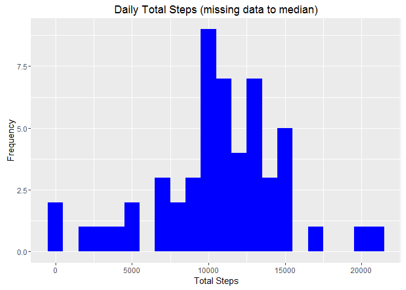

``` r
knitr::opts_chunk$set(echo = TRUE)
```

### Load the data set and the plotting library:

``` r
setwd("C:/Users/JOSEPH/Documents/DataScience/RepResearch")
library(ggplot2)
ds <- read.csv("activity.csv")
head(ds)
```

    ##   steps       date interval
    ## 1    NA 2012-10-01        0
    ## 2    NA 2012-10-01        5
    ## 3    NA 2012-10-01       10
    ## 4    NA 2012-10-01       15
    ## 5    NA 2012-10-01       20
    ## 6    NA 2012-10-01       25

``` r
dim(ds)
```

    ## [1] 17568     3

Mean Total Number of Steps taken per day
----------------------------------------

We aggregate steps by each date:

``` r
stepTot <- aggregate(steps~date,ds,sum,na.rm=TRUE)
dim(stepTot)
```

    ## [1] 53  2

``` r
head(stepTot)
```

    ##         date steps
    ## 1 2012-10-02   126
    ## 2 2012-10-03 11352
    ## 3 2012-10-04 12116
    ## 4 2012-10-05 13294
    ## 5 2012-10-06 15420
    ## 6 2012-10-07 11015

### Histogram of the total number of steps taken each day

``` r
ggplot(stepTot, aes(x = steps)) +geom_histogram(fill = "purple", binwidth = 1000) +
 labs(title = "Daily Total Steps", x = "Total Steps", y = "Frequency")
```

<!-- -->

#### Mean total number of steps taken per day:

``` r
stepMean <-  mean(stepTot$steps, na.rm=TRUE)
stepMean
```

    ## [1] 10766.19

#### Median total number of steps taken per day:

``` r
stepMedian <-  median(stepTot$steps, na.rm=TRUE)
stepMedian
```

    ## [1] 10765

Daily Activity Pattern
----------------------

Daily Steps Averages:

``` r
stepAvg <- aggregate(steps~interval,ds,mean,na.rm=TRUE)
head(stepAvg)
```

    ##   interval     steps
    ## 1        0 1.7169811
    ## 2        5 0.3396226
    ## 3       10 0.1320755
    ## 4       15 0.1509434
    ## 5       20 0.0754717
    ## 6       25 2.0943396

``` r
summary(stepAvg)
```

    ##     interval          steps        
    ##  Min.   :   0.0   Min.   :  0.000  
    ##  1st Qu.: 588.8   1st Qu.:  2.486  
    ##  Median :1177.5   Median : 34.113  
    ##  Mean   :1177.5   Mean   : 37.383  
    ##  3rd Qu.:1766.2   3rd Qu.: 52.835  
    ##  Max.   :2355.0   Max.   :206.170

### Time series plot of the 5-minute interval and the average number of steps taken, averaged across all days

Let us plot Average Daily Steps

``` r
ggplot(stepAvg, aes(x =interval , y=steps)) +
  geom_line(size=1) +
  labs(title = "Average of Daily Steps", x = "Interval", y = "Avg. Steps per day")
```

<!-- --> \#\#\#5-minute interval, on average across all the days in the dataset, that contains the maximum number of steps

``` r
stepAvg[which.max(stepAvg$steps),]$interval
```

    ## [1] 835

Imputing missing values
-----------------------

Missing data will be replaced with the mean for that day

``` r
dsNew <- ds
notEx <- is.na(ds$steps)
repl <- tapply(dsNew$steps, dsNew$interval, mean, na.rm=TRUE, simplify = TRUE)
dsNew$steps[notEx] <- repl[as.character(dsNew$interval[notEx])]
head(dsNew)
```

    ##       steps       date interval
    ## 1 1.7169811 2012-10-01        0
    ## 2 0.3396226 2012-10-01        5
    ## 3 0.1320755 2012-10-01       10
    ## 4 0.1509434 2012-10-01       15
    ## 5 0.0754717 2012-10-01       20
    ## 6 2.0943396 2012-10-01       25

A new histogram of total steps for the comlete data set:

``` r
stepAvgNew <- aggregate(steps~interval,dsNew,mean,na.rm=TRUE)
ggplot(stepTot, aes(x = steps)) +geom_histogram(fill = "blue", binwidth = 1000) +
  labs(title = "Daily Total Steps (missing data to median)", x = "Total Steps", y = "Frequency")
```

<!-- --> \#\#Differences in activity patterns between weekdays and weekends

We add field wDay to the data frame to distinguish week ends from week days

``` r
dsNew$date <- as.Date(dsNew$date)
#create a vector of weekdays
weekdays1 <- c('Monday', 'Tuesday', 'Wednesday', 'Thursday', 'Friday')
head(dsNew)
```

    ##       steps       date interval
    ## 1 1.7169811 2012-10-01        0
    ## 2 0.3396226 2012-10-01        5
    ## 3 0.1320755 2012-10-01       10
    ## 4 0.1509434 2012-10-01       15
    ## 5 0.0754717 2012-10-01       20
    ## 6 2.0943396 2012-10-01       25

``` r
dsNew$wDay <- factor((weekdays(dsNew$date) %in% weekdays1), 
                   levels=c(FALSE, TRUE), labels=c('weekend', 'weekday') )

##Reorder columns
dsNew<- dsNew[, c("wDay","date", "interval", "steps")]
head(dsNew)
```

    ##      wDay       date interval     steps
    ## 1 weekday 2012-10-01        0 1.7169811
    ## 2 weekday 2012-10-01        5 0.3396226
    ## 3 weekday 2012-10-01       10 0.1320755
    ## 4 weekday 2012-10-01       15 0.1509434
    ## 5 weekday 2012-10-01       20 0.0754717
    ## 6 weekday 2012-10-01       25 2.0943396

Aggregate the data, split by Interval and wDay

``` r
stepAvgNewW <- aggregate(steps~interval+wDay,data=dsNew,mean,na.rm=TRUE)
head(subset(stepAvgNewW,wDay=="weekend"))
```

    ##   interval    wDay       steps
    ## 1        0 weekend 0.214622642
    ## 2        5 weekend 0.042452830
    ## 3       10 weekend 0.016509434
    ## 4       15 weekend 0.018867925
    ## 5       20 weekend 0.009433962
    ## 6       25 weekend 3.511792453

``` r
head(subset(stepAvgNewW,wDay=="weekday"))
```

    ##     interval    wDay      steps
    ## 289        0 weekday 2.25115304
    ## 290        5 weekday 0.44528302
    ## 291       10 weekday 0.17316562
    ## 292       15 weekday 0.19790356
    ## 293       20 weekday 0.09895178
    ## 294       25 weekday 1.59035639

Plot comparison, Week End vs. Week Day

``` r
ggplot(stepAvgNewW, aes(x =interval , y=steps, color=wDay)) +
  geom_line() +
  labs(title = "Avg. Daily Steps Week Day vs Week End", x = "Interval", y = "Num of Steps") +
  facet_wrap(~wDay, ncol = 1, nrow=2)
```

<!-- -->
